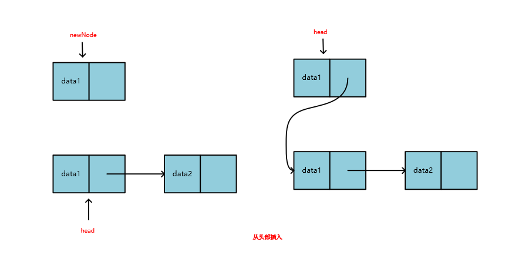
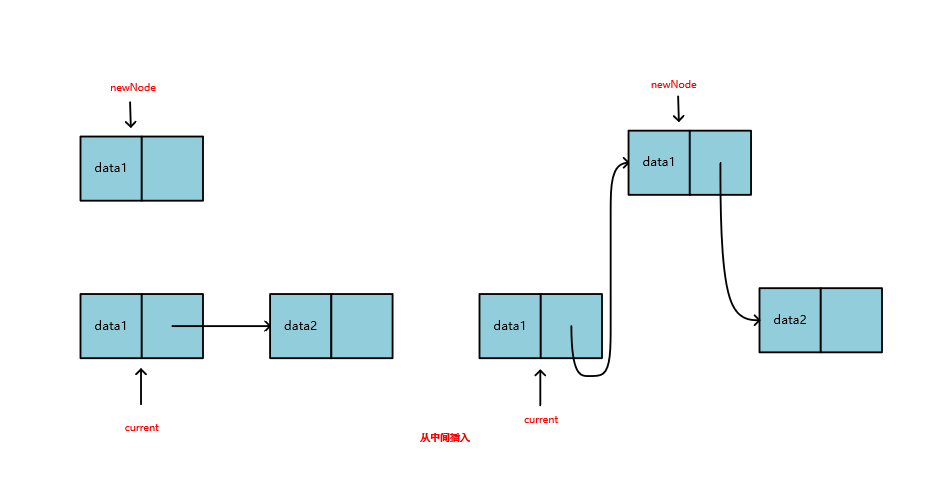
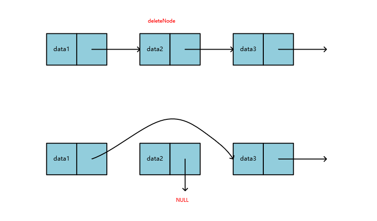
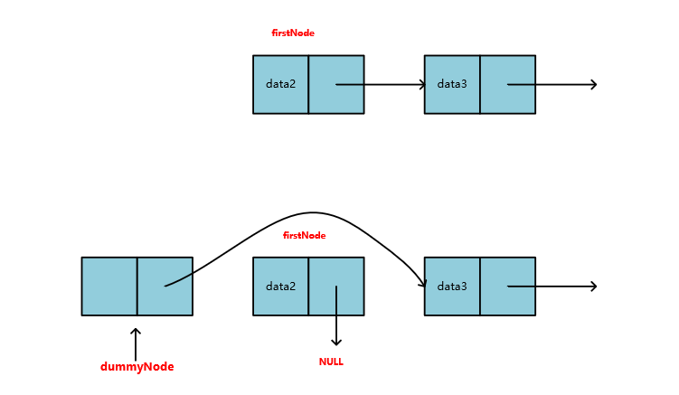
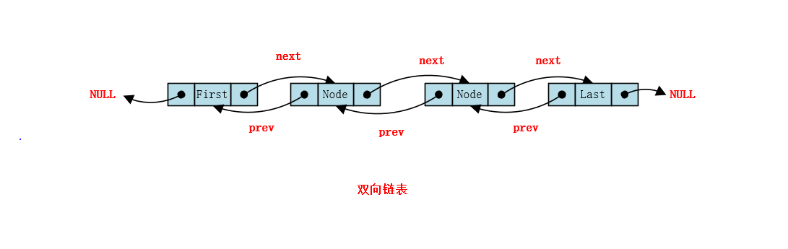
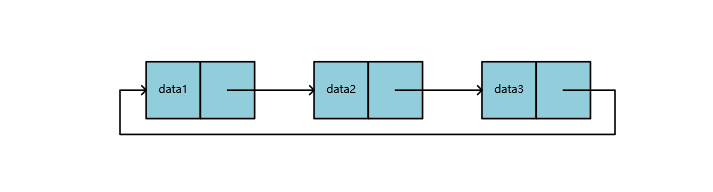

# 链表

## 单链表

### 基础结构

单链表是一种最基础的链表结构，它由一个个链表节点构成，每个链表的节点分为两个部分**data**和**link**。如图所示


其中**data**保存着用户数据，而**link**保存这一个指针，用来指向下一个链表的节点。一个线性表如果用链表来存储的话，结构大概是这样的。


### 定义

```java
private static class Node<E> {
    E e;
    Node<E> next;

    Node(E e, Node<E> next) {
        this.e = e;
        this.next = next;
    }
}
```

### 插入操作

单链表的插入可以分为三种情况讨论：

1. 从头部插入



```java
/**
  * 向链表头部添加元素 O(1)
  *
  * @param e e
  */
public void addFirst(E e) {
    linkFirst(e);
}

private void linkFirst(E e) {
    final Node<E> newNode = new Node<>(e, first);
    first = newNode;
    if (null == last) {
        last = newNode;
    }
    size++;
}
```

2. 从中间插入



```java
/**
 * 向指定位置添加元素 O(N)
 *
 * @param index index
 * @param e e
 */
public void add(int index, E e) {
    if (index < 0 || index > size) {
        throw new IllegalArgumentException("index invalid");
    }

    if (index == 0) {
        linkFirst(e);
    } else if (index == size) {
        linkLast(e);
    } else {
        linkAfter(index, e);
    }
}

private void linkAfter(int index, E e) {
    Node<E> helpNode = first;
    for (int i = 0; i < index - 1; i++) {
        helpNode = helpNode.next;
    }
    helpNode.next = new Node(e, helpNode.next);
}
```

3. 从尾部插入


```java
/**
 * 向链表中添加元素，默认向尾部添加O(1)
 *
 * @param e e
 */
public void add(E e) {
    linkLast(e);
}

private void linkLast(E e) {
    final Node<E> currNode = last;
    final Node<E> newNode = new Node<>(e, null);
    last = newNode;
    if (null == first) {
        first = newNode;
    } else {
        currNode.next = newNode;
    }
    size++;
}
```

结合以上分析和代码可以看出单链表插入操作的时间复杂度也是与插入位置有关的。

1. 如果是头插法，那么时间复杂度是O(1)
2. 如果是尾插法，那么时间复杂度也是O(1)
3. 如果想插入到指定位置，那么就需要遍历链表先找到插入点，整个时间复杂度就是O(N)了

### 删除操作

链表的删除操作也可以分为三种情况讨论

1. 删除链表的中间节点



删除中间节点，只要找到待删除节点的前驱节点，然后暂时保存待删除节点，让前驱节点的指针指向待删除节点的后继节点，最后将待删除节点的指针指向NULL。方便垃圾回收。

2. 删除链表的头结点

删除链表的头结点也是类似的，但是有一个问题，如果是中间节点尚且可以找到这个前驱节点，那如果是头结点怎么办呢？操作起来不太方便啊。所以大佬们给我们设立了一个**虚拟头结点**，也叫**哑结点**。这个节点不保存数据，只是用来做一个指向，指向链表的头部，这样链表真正保存数据的节点就是从第二个节点开始的，那么我们删除头结点的方式是不是就变成了上面删除中间节点的一般情形呢？



3. 删除尾节点

在单链表中，因为只能根据当前节点找到后继节点，而不能找到前驱节点，因此删除尾结点的情况也可以看成删除中间节点的一般情况。时间复杂度就变成了最坏的情况O(N)。

下面我们用代码来实现。这里我们用了一个辅助的fisrt节点指向头，last节点指向尾，没有用虚拟头结点。

```java
/**
 * 删除第一个元素
 *
 * @return
 */
public E removeFirst() {
    if (null == first) {
        throw new NoSuchElementException("List is empty");
    }
    return unlinkFirst();
}

private E unlinkFirst() {
    final Node<E> helpNode = first;
    E e = helpNode.e;
    first = helpNode.next;
    if (null == first) {
        last = null;
    }
    helpNode.next = null;
    helpNode.e = null;
    size--;
    return e;
}

/**
 * 删除最后一个元素
 *
 * @return
 */
public E removeLast() {
    return unlink(size - 2);
}

/**
 * 删除指定位置的元素
 *
 * @param index
 * @return
 */
public E remove(int index) {
    return unlink(index - 2);
}

private E unlink(int index) {
    checkIndex(index);

    Node<E> node = first;
    for (int i = 0; i < index; i++) {
        node = node.next;
    }
    Node<E> deleteNode = node.next;
    E deleteElement = deleteNode.e;
    node.next = deleteNode.next;

    deleteNode.next = null;
    deleteNode.e = null;
    size--;
    return deleteElement;
}

/**
 * 删除指定元素
 *
 * @param e
 * @return
 */
public boolean remove(E e) {
    return removeElement(e);
}

public boolean removeElement(E e) {
    if (first != null && first.e == e) {
        removeFirst();
        return true;
    } else {
        Node<E> helpNode = first;
        while (helpNode != null && helpNode.next != null) {
            if (e.equals(helpNode.next.e)) {
                break;
            }
            helpNode = helpNode.next;
        }
        if (null != helpNode && null != helpNode.next) {
            Node<E> deleteNode = helpNode.next;
            if (deleteNode.e == last.e) {
                last = helpNode;
            }
            helpNode.next = deleteNode.next;
            deleteNode.next = null;
            deleteNode.e = null;
            size--;
            return true;
        }
        return false;
    }
}
```

结合上面图例分析和代码，我们可以看出单链表的删除时间复杂度也是与删除元素的位置有关的

1. 如果是删除头结点，那么时间复杂度就是O(1)
2. 如果是删除尾结点或者中间节点，总得先找到待删除的位置，那么时间复杂度就是O(N)

### 查找操作

查找元素

```java
/**
 * 查找元素
 *
 * @param index index
 * @return E e
 */
public E get(int index) {
    checkIndex(index);
    Node<E> currNode = first;
    for (int i = 0; i < index; i++) {
        currNode = currNode.next;
    }
    return currNode.e;
}

/**
 * 获取最后一个元素
 *
 * @return E e
 */
public E getLast() {
    return null == last ? null : last.e;
}

/**
 * 获取第一个元素
 *
 * @return E e
 */
public E getFirst() {
    return null == first ? null : first.e;;
}

/**
 * 判断链表是否包含指定元素
 *
 * @param e
 * @return
 */
public boolean contains(E e) {
    for (Node<E> x = first; x != null; x = x.next) {
        if (x.e == e) {
            return true;
        }
    }
    return false;
}
```

综上，查询的时间复杂度普遍情况也是O(N)，最好情况是获取头结点和尾结点，时间复杂度是O(1)。

## 双向链表

如上所示，可以看出单向链表的可以根据当前节点直接找到它的后继节点，但是要是我们想找前驱节点可就麻烦了啊。。于是为了解决这个问题就有了**双向链表**这个概念。双向链表中每个节点不仅有数据、有指向下一个节点的指针，还维护了一个指向前一个节点的指针，这样就可以很方便的**访问一个节点的前驱节点和后继节点**。



双线链表的实现和单链表的实现基本一致，`java.util.LinkedList`就是采用这种实现，可以参考。代码可以简单参考下文LRU缓存淘汰算法。

## 循环链表

除了双向链表，还有一种循环链表，他的尾结点不是只想NULL，而是一个指向头结点的指针，将整个链表形成一个环，他为我们解决**通过链表中任何一个节点都可以找到链表中其他的任一节点**这样一个问题。可参考下文约瑟夫问题理解。



## 链表的应用

### 设计一个LRU缓存淘汰算法（LeetCode 146）

运用你所掌握的数据结构，设计和实现一个  LRU (最近最少使用) 缓存机制。它应该支持以下操作： 获取数据 get 和 写入数据 put 。

- 获取数据 `get(key) `- 如果关键字 (key) 存在于缓存中，则获取关键字的值（总是正数），否则返回 -1。
- 写入数据 `put(key, value)` - 如果关键字已经存在，则变更其数据值；如果关键字不存在，则插入该组「关键字/值」。当缓存容量达到上限时，它应该在写入新数据之前删除最久未使用的数据值，从而为新的数据值留出空间。

**进阶:**

你是否可以在 O(1) 时间复杂度内完成这两种操作？

**需求分析：**

这个算法主要核心几点需求是：

1. get方法，支持O(1)时间复杂度

   1. 没有找到数据，返回-1
   2. 找到数据，将原来的节点删除，放到链表头部

2. put方法，时间复杂度O(1)

   1. 如果已经存在，那么需要更新数据，将原来的节点删除，并将更新后的节点放到链表头
   2. 如果不存在，创建一个新节点，这时要考虑添加一个新节点后容量是否会超出
      1. 容量溢出：需要删除最后一个节点
      2. 容量没有溢出：将链表尾部节点删除，腾出一个空间，将新节点插入到链表头

这样我们就保证了最终将长久以来最少使用的那些数据放到了链表尾部

**算法设计**

这里问题难在选择什么数据结构，那么如果要查询时间复杂度可以达到O(1)，那么肯定是哈希表了。但是哈希表又做不到插入时间复杂度为O(1)，那么我们就想到是不是可以用链表啊，那么是用单链表呢还是双向链表呢，因为这个题目中有一点是：如果找到了元素，还要把该元素从原来的位置删除。可是单链表只能在删除头和尾部这种特殊节点的时候才可以做到O(1)的时间复杂度啊，因此必须得用双向链表了。用了双链表，如果我们把链表的每一个节点都保存到哈希表里，是不是当需要从链表中删除的时候，只要通过哈希表拿到这个节点，就可以很方便的进一步拿到他的前驱后继节点，然后进行删除，这个整个时间复杂度就是O(1)。

**代码实现**


```java
public class LRUCache {
    private static class Node {
        int key;
        int value;
        Node prev;
        Node next;

        public Node() {}

        public Node(int key, int value) {
            this.key = key;
            this.value = value;
        }
    }

    private int size;
    private int capacity;
    private Node head;
    private Node tail;
    private HashMap<Integer, Node> map;

    public LRUCache(int capacity) {
        this.capacity = capacity;
        this.map = new HashMap<>(capacity);
        this.head = new Node();
        this.tail = new Node();
        head.next = tail;
        tail.prev = head;
    }

    /**
     * 是否存在
     *      否：值返回-1
     *      是：将原来的节点删除，然后放到链表头，返回数据
     *
     * @param key
     * @return
     */
    public int get(int key) {
        if (map.containsKey(key)) {
            Node node = map.get(key);
            remove(node);
            addFirst(node);
            return node.value;
        } else {
            return -1;
        }
    }

    /**
     * 是否存在：
     *     否：创建新节点，并且判断是否超过容量
     *         否：景新节点加到链表头
     *         是：删除队尾节点，插入到链表头
     *     是：更新数据，然后从原来的位置移除，放到头结点
     *
     * @param key
     * @param value
     */
    public void put(int key, int value) {
        Node node = map.get(key);
        if (null == node) {
            Node newNode = new Node(key, value);
            map.put(key, newNode);
            addFirst(newNode);
            size++;
            if (capacity < size) {
                map.remove(tail.prev.key);
                removeLast();
                size--;
            }
        } else {
            node.value = value;
            remove(node);
            addFirst(node);
        }
    }

    private void remove(Node node) {
        node.prev.next = node.next;
        node.next.prev = node.prev;
    }

    private void addFirst(Node node) {
        node.next = head.next;
        head.next.prev = node;
        node.prev = head;
        head.next = node;
    }

    private void removeLast() {
        Node lastNode = tail.prev;
        tail.prev = lastNode.prev;
        lastNode.prev.next =tail;
    }
}
```

### 约瑟夫问题

约瑟夫问题大概是样的，是说有一天约瑟夫他们这个国家被敌人攻陷了，他们一群人，总数设为N，被迫逃到了一个山洞。他们的领导者决议宁死不降，所以想了一个自杀的游戏，就是大家坐成一圈，从第一个报数，每次数到M的人就要自杀，那么约瑟夫做到第几个位置不会死呢？假设N=6，M=4。那么我们看依次挂掉的是谁：

初始位置：1 2 3 4 5 6

第一次出局：4，剩余：1 2 3 5 6，从5开始报数

第二次出局：2，剩余：1 3 5 6，从3开始报数

第三次出局：1，剩余：3 5 6，从3开始报数

第四次出局：3，剩余：5 6。从5开始报数

第五次出局：6，5活了下来

这就是约瑟夫问题的整个过程，那么这个问题，如果用循环链表解决的一个经典问题。下面给出代码

```java
public class JosephProblem {
    private static class Node {
        int item;
        Node next;
        public Node(int item) {
            this.item = item;
        }
    }

    private Node head;
    private Node tail;
    private int size;

    public int size() {
        return size;
    }

    public void add(int item) {
        Node newNode = new Node(item);
        if (head == null) {
            head = newNode;
        } else {
            tail.next = newNode;
        }
        tail = newNode;
        tail.next = head;
        size++;
    }

    public int remove(int M) {
        Node currNode = head;
        for (int i = 1; i < M - 1; i++) {
            currNode = currNode.next;
        }
        Node deleteNode = currNode.next;
        currNode.next = deleteNode.next;
        head = deleteNode.next;
        size--;
        return deleteNode.item;
    }

    public int get() {
        return head.item;
    }

    public static void main(String[] args) {
        JosephProblem jp = new JosephProblem();
        jp.add(1);
        jp.add(2);
        jp.add(3);
        jp.add(4);
        jp.add(5);
        jp.add(6);

        while (jp.size() != 1) {
            System.out.printf("the ID %d is killed \n", jp.remove(4));
            if (jp.size == 1) {
                break;
            }
        }
        System.out.printf("the remainder number is %d and the survivor ID is %d", jp.get(), jp.get());
    }
}
```

### 链表其他应用

链表这种经典的数据结构真的是用的太多了，`LinkedList`的实现基于链表，队列和栈也可以基于链表实现，AQS中也用到了双向链表实现同步队列，用单链表实现条件队列。。。具体的就参考各部分的笔记了。

