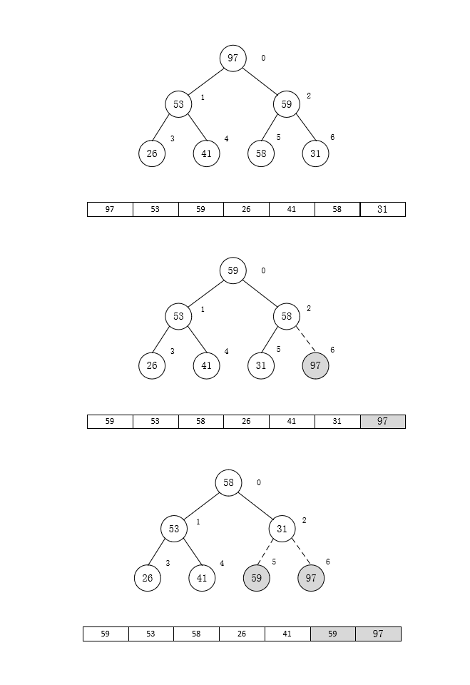

# 堆排序

## 堆排序的主要思想

关于什么是堆，可以看看/heap/MaxHeap.md。这里就不在啰嗦了。

关于堆，我们知道有个最主要的性质，对于`最大堆`，堆顶的元素总是最大的，对于`最小堆`，堆顶的元素总是最小的。所以如果我们将一个数组转化成一个堆，在反复执行删除堆顶元素的操作，那么每次删除的元素必然是有序的，也就实现了我们排序的效果。

因此，堆排序的步骤主要两点：

1. 构建堆，将一个数组转化成一个堆，我们在MaxHeap.md中有总结，时间复杂度是O(n log<sub>2</sub>n)
2. 遍历删除堆顶的元素，我们知道删除堆顶元的时间复杂对是O(log<sub>2</sub>n)，那么如果堆中有n个元素，则时间复杂度变成O(nlog<sub>2</sub>n)。由此得出堆排序的时间复杂度是O(nlog<sub>2</sub>n)。

综上所述，我们发现如果这样做，那么时间复杂度是没有问题的，但是空间上则需要使用一个附加的数组来存储每次删除的元素，使得存储需求增加一倍。那么这个问题怎么规避呢，我们知道删除堆顶元素后，为了维护堆的性质，我们的做法是将最后一个元素放到堆顶位置，在进行siftDown()操作。比如下图，我们删除97后，会将31放到堆顶`（这个时候31的位置就空下来了）`，然后调整堆。那么我们就可以利用这一点，将97放到空下来的位置。然后依次类推，我们在删除59，那么还是31的位置空下来，我们在将59放到空下来的位置，直到堆中剩下一个元素，这个时候你会发现数组已经是有序的了，并且没有额外占用空间。



代码实现如下：

```java

    // 获取节点的左孩子索引
    private static int getLeft(int index) {
        return 2 * index + 1;
    }

    // 获取节点的右孩子索引
    private static int getRight(int index) {
        return 2 * index + 2;
    }

    private static void swapReference(int[] arr, int i, int j) {
        int tmp = arr[i];
        arr[i] = arr[j];
        arr[j] = tmp;
    }

	// 下沉操作调整堆 O(logN)
    private static void siftDown(int[] arr, int index, int size) {
        int child = 0;
        int tmp = arr[index];
        for (; getLeft(index) < size; index = child) {
            // 找到左右孩子中较大的元素
            child = getLeft(index);
            if (child != size - 1 &&
                    arr[getLeft(index)] < arr[getRight(index)]) {
                child = getRight(index);
            }
            if (tmp < arr[child]) {
                arr[index] = arr[child];
            } else {
                break;
            }
        }
        arr[index] = tmp;
    }

    // 构建堆
    private static void buildHeap(int[] arr) {
        for (int i = arr.length / 2 - 1; i >= 0; i--) {
            siftDown(arr, i, arr.length);
        }
    }

    /**
     * 堆排序
     *
     * @param arr 待排序数组
     */
    public static void heapSort(int[] arr) {
        buildHeap(arr);
        // 遍历执行deleteMax方法，因为删除一个堆顶元素，堆尾元素就空出来了，
        // 将删除的元素放到堆尾，这样就达到了排序效果，并且利用了堆的原始数组，节省了空间
        for (int i = arr.length - 1; i > 0; i--) {
            swapReference(arr, 0, i);
            siftDown(arr,0, i);
        }
    }
```

