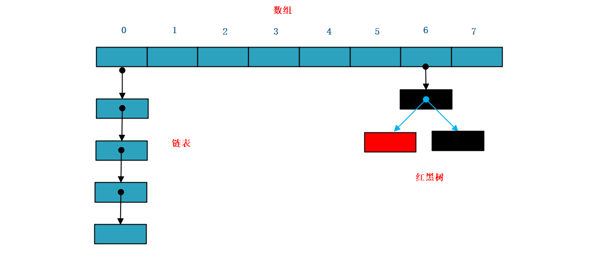

# hashCode方法介绍

## hashCode方法的意义

JDK官方API给出的解释：

```
public int hashCode()
```

Returns a hash code value for the object. This method is supported for the benefit of hash tables such as those provided by [`HashMap`](https://docs.oracle.com/javase/8/docs/api/java/util/HashMap.html).

The general contract of `hashCode` is:

- Whenever it is invoked on the same object more than once during an execution of a Java application, the `hashCode` method must consistently return the same integer, provided no information used in `equals` comparisons on the object is modified. This integer need not remain consistent from one execution of an application to another execution of the same application.
- If two objects are equal according to the `equals(Object)` method, then calling the `hashCode` method on each of the two objects must produce the same integer result.
- It is *not* required that if two objects are unequal according to the [`equals(java.lang.Object)`](https://docs.oracle.com/javase/8/docs/api/java/lang/Object.html#equals-java.lang.Object-) method, then calling the `hashCode` method on each of the two objects must produce distinct integer results. However, the programmer should be aware that producing distinct integer results for unequal objects may improve the performance of hash tables.

As much as is reasonably practical, the hashCode method defined by class `Object` does return distinct integers for distinct objects. (This is typically implemented by converting the internal address of the object into an integer, but this implementation technique is not required by the Java™ programming language.)

大致意思是，hashCode方法用来返回一个整数值，并且这个方法主要为java中的hash表提供便利，比如像HashMap。

关于hashCode方法有以下几个约定：

1. 对于同一个对象，调用他的hashCode()方法必须返回同一个int值。
2. 如果object1.equals(object2)的结果为true，那么object1.hashCode() = object1.hashCode()必须成立
3. 如果object1.equals(object2)的结果为false，那么object1.hashCode() = object1.hashCode()不用必须成立，但是为不同对象生成不同的hashCode值可能会提高hash表的性能。


## 常见类对hashCode方法的实现

hashCode方法为Object类的可继承方法，默认实现是返回对象的引用，在String和Integer等类型都对hashCode方法进行了重写。

```java
/**
 * String的hashCode方法  s[0]*31^(n-1) + s[1]*31^(n-2) + ... + s[n-1]
 * s:给定的字符串
 * n:字符创的长度
 * 31: 31 = 2^5 - 1 --> 31 * i = 2 << 5 * i - i --> 位移运算比较快 
 *     31是一个大小合适的质数，算出来的hash值分布均匀，不容易冲突，太大会导致算出来的int值超出int的范围
 */
public int hashCode() {
    int h = hash;
    if (h == 0 && value.length > 0) {
        char val[] = value;

        for (int i = 0; i < value.length; i++) {
            h = 31 * h + val[i];
        }
        hash = h;
    }
    return h;
}
```
```java
// Integer的hashCode方法  int类型直接返回int类型
public static int hashCode(int value) {
    return value;
}
```


## 怎么理解hashCode是为HashMap提供的

### HashMap的结构



### HashMap插入数据的过程

HashMap是java对Hash表的一种实现，他保持了哈希表存储key-value键值对的特点，并且可以通过key快速获取value。他的插入过程大概分为以下几个步骤：

1. 开辟一个数组空间，当插入一个元素时，首先通过hashCode(key)这个方法获取一个hash值，假如是0，那么这个元素就被插入到上面图例中的0这个位置。
2. 假设再进来一个元素key1-value1，通过我们设计的hashCode(key1)求得的hash值和hashCode(key)相等`（哈希冲突）`，这个时候0这个位置已经有元素了，怎么办呢，那就在0这个位置加一个`链表`，将新来的第二个元素存入这个链表`（链地址法）`。
3. 当这个链表数据越来越多，多到一定程度时候，链表这种数据结构的缺点就暴露出来了，虽然向链表头部添加节点的时间复杂度为`O(1)`，但是查询的效率是`O(N)`，会导致HashMap的性能出现问题。所以JDK1.8之后，引入了`红黑树`。红黑树是一种高度平衡的二叉查找树，他的查找和插入的时间复杂度都是`O(logN)`，可以很好的解决性能问题。那么为什么不一开始就用红黑树，而是当数据到达一定程度时候再用红黑树呢，大概是因为红黑树虽然时间复杂度很低，但是为了达到红黑树的平衡，经常需要进行一系列的`左旋`、`右旋`，也会花费时间。所以其实数据不多的时候用链表是比较好的。


## 为什么重写了equals()方法，一定要重写hashCode()方法

### hashCode()、 ==、 equals()的区别

`== `比较两个对象的引用，

`hashCode() `返回对象的哈希值

`equals()`的默认实现如下，是比较两个对象的引用是否一样，和==是一样的。

```java
public boolean equals(Object obj) {
    return (this == obj);
}
```

### 重写hashCode()方法提高效率

如果重写了hashCode()方法，当我们需要比较两个对象是否相等时，首先计算hashCode，如果不同，则认为两个对象不同，不用再用equals()方法进行比较。如果hashCode相同，在通过equals()比较，这样有利于提高效率。

### 重写equals但不重写hashCode()会发生什么?

equals()默认实现是比较两个对象的引用是否一样。但是大多数情况下我们创建的对象，例如Student对象，我们一般会重写equals()方法，当满足年龄、学号、班级等对象都一致的时候才说明他们是同一个对象。这个时候如果不重写equals()方法，则会出现hashCode算出来的值不同，但是equals()方法比较的结果一致。

### hashCode()进一步说明

有了上面的谈论，我们在对hashCode()方法做点总结：hashCode的作用

1.  hashCode()函数主要作用是提供一个好的寻址能力，可以快速支持通过key得到value
2.  另一个作用是和equals结合比较两个对象是否相等

hashCode方法的要求：

1.  一致：key1 = key2，则hashCode(key1) = hashCode(key1)
2.  高效：计算起来要快
3.  均匀：算出来的hash值要分布均匀