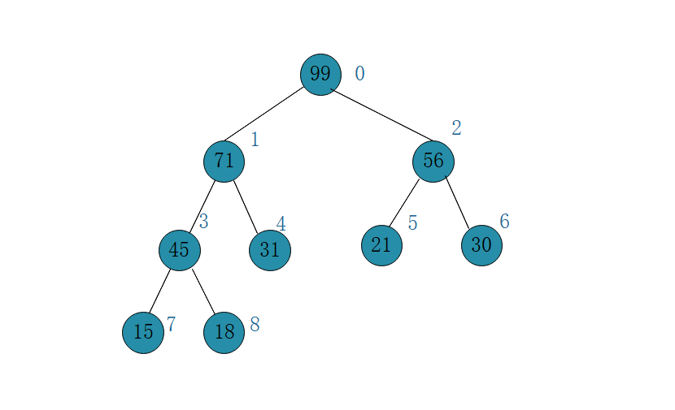
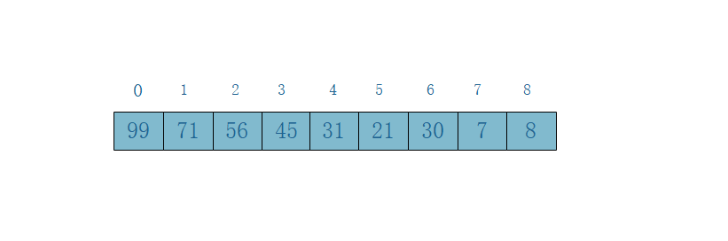
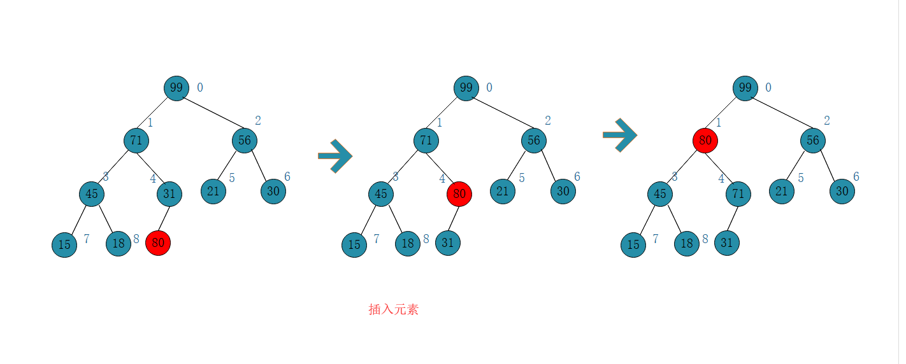
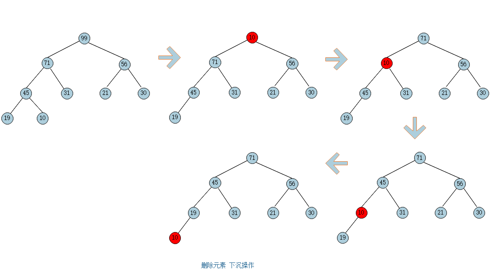

# 二叉堆

##  二叉堆的定义

1. 二叉堆是一颗完全二叉树

   完全二叉树：把元素一层一层放，如果每一层都放满，没有空的叶子节点，就是满二叉树，如果有空的叶子节点，那就是完全二叉树。

2. 二叉树中每一个节点的值总是小于父节点的值（最大堆）。如下图所示便是一个最大二叉堆

   
## 用数组表示表示堆

   如上二叉堆我们可以用这样一个数组表示，将堆中的元素按顺序依次放入数组中，这样的话，要表示一个节点的父子关系不如定义成树结构，可以用指针方便的表示。但其实我们观察可以发现每一个节点他的父子关系与他在数组中的索引是有一定关系的：

   节点的父元素索引：(index - 1) / 2
   节点的左孩子索引：2 * index + 1
   节点的右孩子索引：2 * index + 2

   

## 向堆中添加元素



向二叉堆中插入元素的过程如上如图所示，首先插入80，发现破坏了最大堆的性质，因此将80和父元素交换位置，交换后，80和父元素71相比，需要继续交换位置，直到满足最大堆的性质。这个过程叫元素的`上浮`

代码实现：

```java
    /**
     * 向堆中添加元素
     *
     * @param e
     */
    public void add(E e) {
        data.addLast(e);
        siftUp(data.getSize() - 1);
    }

    /**
     * 堆中元素的上浮
     *
     * @param index 要上浮元素的索引
     */
    public void siftUp(int index) {
        while (index > 0 && data.get(index).compareTo
                (data.get(getParentIndex(index))) > 0) {
            data.swap(index, getParentIndex(index));
            index = getParentIndex(index);
        }
    }
    
    /**
     * 交换元素
     * @param i
     * @param j
     */
    public void swap(int i, int j) {
        if (i < 0 || i > size) {
            throw new IllegalArgumentException("index is illegal");
        }
        E e = data[i];
        data[i] = data[j];
        data[j] = e;
    }
```

## 从堆中删除元素



删除元素的过程如图所示：首先删除堆顶元素，然后将最后一个元素挪到堆顶，这个时候破坏了堆的性质，就开始执行下沉操作，让堆顶元素和孩子比较，将较大的孩子上移，堆顶元素下沉，直到符合堆的条件为止。

```java
    /**
     * 取出堆中最大元素
     *
     * @return
     */
    public E extractMax() {
        E maxItem = findMax();

        data.swap(0, data.getSize() - 1);
        data.removeLast();
        siftDown(0);

        return maxItem;
    }

    /**
     * 堆中元素的下沉
     *
     * @param index
     */
    private void siftDown(int index) {
        int childIndex = 0;
        while (getLeftChildIndex(index) < data.getSize()) {
            childIndex = getLeftChildIndex(index);
            // 找到两个孩子中最大的节点
            if (childIndex + 1 < data.getSize() &&
                    data.get(childIndex + 1).compareTo(data.get(childIndex)) > 0) {
                childIndex = getRightChildIndex(index);
            }
            if (data.get(index).compareTo(data.get(childIndex)) >= 0) {
                break;
            }
            data.swap(index, childIndex);
            index = childIndex;
        }
    }
```

## 最小堆的实现，基于以上代码在交换元素的实现有优化

```java
/**
 * 最小堆
 *
 * @author HXY
 * @param <E>
 */
public class MinHeap<E extends Comparable<E>> {
    private static final int DEFAULT_CAPACITY = 10;
    private int size;
    private E[] array;

    /**
     * 构造函数，构造指定容量的最小堆
     */
    public MinHeap(int capacity) {
        array = (E[]) new Comparable[capacity];
        size = 0;
    }

    /**
     * 构造函数，构造容量为10的最小堆
     */
    public MinHeap() {
        this(DEFAULT_CAPACITY);
    }

    /**
     * 构造函数，将一个数组转化为最小堆
     *
     * @param items 数组
     */
    public MinHeap(E[] items) {
        this(items.length);
        for (int i = 1; i <= items.length; i++) {
            array[i] = items[i];
        }
        buildHeap();
        size = items.length;
    }

    private void buildHeap() {
        for (int i = size / 2; i > 0; i--) {
            siftDown(i);
        }
    }

    /**
     * 是否为空
     * @return
     */
    public boolean isEmpty() {
        return size == 0;
    }

    /**
     * 查找最小元素
     *
     * @return 堆顶元素
     */
    public E findMin() {
        if (isEmpty()) {
            throw new IllegalArgumentException("Can not find min because the heap is empty.");
        }

        return array[0];
    }

    private void enlargeArray(int newCapacity) {
        E[] newData = (E[]) new Comparable[newCapacity];
        for (int i = 0; i < array.length; i++) {
            newData[i] = array[i];
        }
        array = newData;
    }

    /**
     * 添加元素
     *
     * @param e
     */
    public void insert(E e) {

        if (array.length - 1 == size) {
            enlargeArray(2 * array.length + 1);
        }

        // 如果使用交换的方法，需要三次赋值，一个元素上浮d层，就需要3d次赋值，我们这个方法优化可以只用d+1次赋值
        int hole = ++size;
        for (array[0] = e; e.compareTo(array[hole/2]) < 0; hole /= 2) {
            array[hole] = array[hole/2];
        }
        array[hole] = e;
    }

    /**
     * 删除堆顶元素
     *
     * @return 堆顶元素
     */
    public E deleteMin() {
        E minItem = findMin();
        array[1] = array[size--];
        siftDown(1);
        return minItem;
    }

    /**
     * 下沉操作
     *
     * @param hole 开始下沉的位置
     */
    private void siftDown(int hole) {
        int child = 0;
        E tmp = array[hole];
        for (; hole * 2 <= size; hole = child) {
            child = hole * 2;
            if (child != size
                    && array[child + 1].compareTo(array[child]) < 0) {
                child++;
            }
            if (array[child].compareTo(tmp) < 0) {
                array[hole] = array[child];
            } else {
                break;
            }
        }
        array[hole] = tmp;
    }

}
```


## leetcode 347题

给定一个非空的整数数组，返回其中出现频率前 k高的元素。

```
输入: nums = [1,1,1,2,2,3], k = 2
输出: [1,2]
```

解题思路参考leetcode官网

```java
package com.leetcode;

import java.util.*;

/**
 * leetcode347 https://leetcode-cn.com/problems/top-k-frequent-elements/
 */
public class Solution347 {

    public static List<Integer> topKFrequent(int[] nums, int k) {
        // 第一步，建立一个key：元素值----value：出现频率的哈希表
        HashMap<Integer, Integer> map = new HashMap<>();
        for (int num : nums) {
            if (map.containsKey(num)) {
                map.put(num, map.get(num) + 1);
            } else {
                map.put(num, 1);
            }
        }

        PriorityQueue<Integer> queue = new PriorityQueue<>(
                (a, b) -> map.get(a) - map.get(b)
        );

        // 维护一个大小为k的最小堆，每次新加元素和堆顶元素进行比较，如果新元素的频率大于堆顶元素，则将堆顶元素
        // 替换为新加入的元素，
        for (int key: map.keySet()) {
            if (queue.size() < k) {
                queue.add(key);
            } else if (map.get(key) > map.get(queue.peek())) {
                queue.remove();
                queue.add(key);
            }
        }

        // 输出堆
        LinkedList<Integer> result = new LinkedList<>();
        while (!queue.isEmpty()) {
            result.add(queue.remove());
        }
        return result;
    }

    public static void main(String[] args) {
        int[] arr = new int[] {1,1,1,2,2,3,3,3};
//        topKFrequent(arr,2);
        System.out.println(topKFrequent(arr, 2));
    }
}

```

