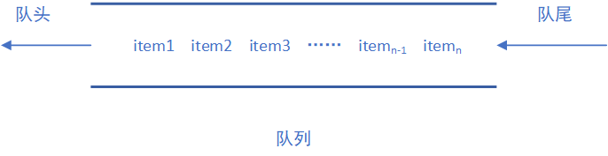
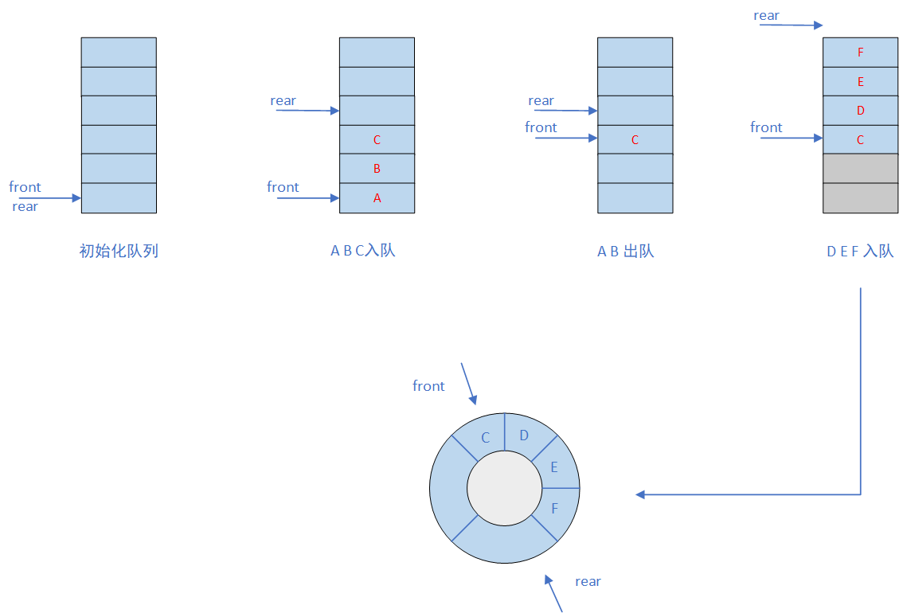
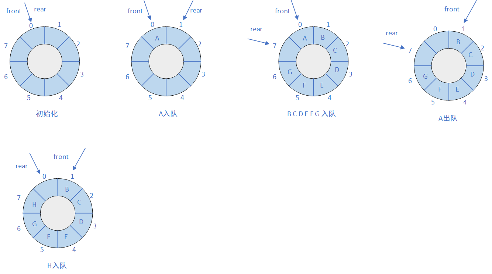
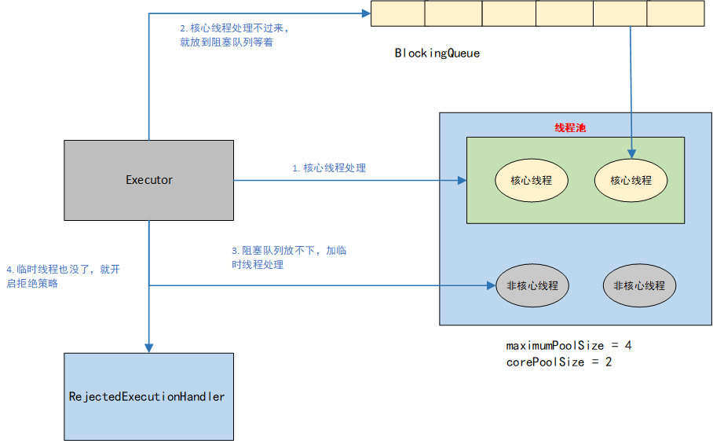
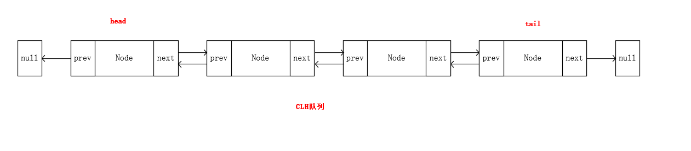

# 队列

## 队列的定义

生活中可能有很多种需要排队的场景，比如中午去食堂打饭，需要排队，排在队头的同学肯定是先去的，所以先打上饭。计算机中也有很多这样的场景，比如作业调度系统，如果同时来几个任务都需要用到输入输出系统，但是输入输出设备只有一套，谁先用呢，也是谁先来谁用，也需要排队。再比如我们的锁机制，如果出现多线程竞争同一把锁，那么同时只有一个线程获得了锁资源，剩下的线程怎么办呢，那如果是公平锁，肯定也是排队，等锁被释放了，那个最先来的线程优先获得锁资源。

那么根据上面的说法我们也大概了解了什么是队列。把他从生活中抽象成一个书本上的概念就是，允许在表的一端插入，另一端删除，插入的一端叫做队头，删除的一端叫做队尾。这就是队列的概念了。他的一大特性就是**先进先出(FIFO)**，这是和栈的区别，栈是后进先出。

下面就是一个队列的示例图。



在进一步，我们可以用代码抽象出队列的接口。

```java
public interface Queue<E> {

    /**
     * 队列中元素的个数
     *
     * @return size
     */
    int getSize();

    /**
     * 队列是否为空
     *
     * @return e
     */
    boolean isEmpty();

    /**
     * 入队
     *
     * @param e e
     */
    void enqueue(E e);

    /**
     * 出队
     *
     * @return e
     */
    E dequeue();

    /**
     * 查看对头元素
     *
     * @return e
     */
    E getFront();
}
```

队列作为线性表的一种，那么他和栈一样，也是可以通过数组和链表实现的，下面我们分享一下代码，部分代码来自慕课网玩转数据结构。

## 数组实现队列

### 基本实现

```java
public class ArrayQueue<E> implements Queue<E> {

    Array<E> array;

    public ArrayQueue(int capacity) {
        array = new Array<>(capacity);
    }

    public ArrayQueue() {
        array = new Array<>();
    }

    @Override
    public int getSize() {
        return array.getSize();
    }

    @Override
    public boolean isEmpty() {
        return array.isEmpty();
    }

    @Override
    public void enqueue(E e) {
        array.addLast(e);
    }

    @Override
    public E dequeue() {
        return array.removeFirst();
    }

    @Override
    public E getFront() {
        return array.get(0);
    }
}
```

### 优化后的循环队列

**数组实现队列的问题（假溢出）**

假如现在有一个空队列，一次入队A B C三个元素，接着A B出对，然后D E F入队，此时看整个队列，如果限定了该队列长度为6，那么这个时候在想插入新元素就会发生**溢出**，因为已经到队尾了啊。但是其实这是一种**假溢出**，因为实际上A B出队后，他们的位置还空着，就像图中那两个灰色的位置。因此原来那种结构就有了一定的局限性，容易造成空间的浪费。

为了避免这种情况，把A B的位置充分利用起来，我们可以把数组的两头连接起来，在逻辑上把这个队列看成一个环，构造出一个**循环队列**，这样当G入队时候，我们就可以将G放到原来A的位置。




**循环队列的入队出队操作**

那接着上一节引出循环队列，我们在详细讨论一下循环队列具体的出队入队过程和一些细节。

我们用下图来表示一个循环队列，他的初始化状态是一个空队列，没有一个元素，这个时候队头和队尾都指向我们的0号位置（**front == rear，用来标志队列空**）。接着A入队，这个时候rear顺时针移动到1号位置。front不变。继续让B C D E F G入队，最终rear移动到了7号位置。这个时候我们的队列还是有空位置的，那么假设在来一个H元素，可以让他入队吗，假设可以，那么rear在顺时针移动一个位置，到了0号位置，这个时候**front == rear**。前面我们说过用**front == rear**来标志队列空的啊，现在队列满也成这样了，怎么办呢？因此呢，肯定这个时候不能让H入队的，当rear到7号位置的时候，就应该已经标志队列是满的。因此假设队列的最大容量是maxSize，那么这一步就可以得出如何区别队列空和队列满的条件：队列空（**front == rear**），队列满（**(rear + 1) % maxSize == front**）。

然后继续让A出队，这个时候front顺时针移动一个位置，0位置就空出来了，队头就成1号位置了。然后再来H入队，这个时候H是可以入队的，H放到7号位置，rear移动到0号位置，那么这个0是怎么算来的呢，是不是可以用求余数的方式算呢，（7 + 1） %  8 = 0。那么当未来某一天队列一直出队，front来到这里的时候，他的位置是不是也可以用同样的位置计算呢。因此又得出两个公式。当front和rear指针到达size - 1位置后，在前进一个一个位置，就又开始回到原点循环了，他们的位置可以这样表示：**front = (front + 1) % maxSize**，**rear = (rear + 1) % maxSize**。




**代码实现**

```java
public class LoopQueue<E> implements Queue<E> {

    private E[] data;
    private int front;
    private int rear;
    private int size;

    public LoopQueue(int capacity) {
        // 因为用了front = size - 1判断队列满，
        // 所以实际初始化capacity的队列只能放capacity - 1个元素
        data = (E[]) new Object[capacity + 1];
        front = 0;
        rear = 0;
        size = 0;
    }

    public LoopQueue() {
        this(10);
    }
    
    @Override
    public int getSize() {
        return size;
    }

    @Override
    public boolean isEmpty() {
        return rear == front;
    }

    @Override
    public void enqueue(E e) {
        if (isFull()) {
            throw new ArrayIndexOutOfBoundsException("queue is full");
        }
        data[rear] = e;
        rear = (rear + 1) % data.length;
        size++;
    }

    @Override
    public E dequeue() {
        if (isEmpty()) {
            throw new IllegalArgumentException("queue is empty");
        }

        E result = data[front];
        data[front] = null;
        front = (front + 1) % data.length;
        size--;
        return result;
    }

    @Override
    public E getFront() {
        if (isEmpty()) {
            throw new IllegalArgumentException("queue is empty");
        }
        return data[front];
    }

    // 队列是否满
    private boolean isFull() {
        if (size == 0) {
            return false;
        }
        return (rear + 1) % data.length == front;
    }
}
```


## 链表实现队列

用链表实现队列也是很简单的，链表的第一个节点作为队头，最后一个节点作为队尾。入队就在链表尾加一个节点，出队就删除链表头。这些都可以参考链表那一节。并且链表不会有**溢出**的问题，因为链表是真正的线性表里能动态扩容的数据结构。

```java
public class LinkedListQueue<E> implements Queue<E> {

    private class Node{
        public E e;
        public Node next;

        public Node(E e, Node next){
            this.e = e;
            this.next = next;
        }

        public Node(E e){
            this(e, null);
        }

        public Node(){
            this(null, null);
        }

        @Override
        public String toString(){
            return e.toString();
        }
    }

    private Node head, tail;
    private int size;

    public LinkedListQueue() {
        this.tail = null;
        this.head = null;
        size = 0;
    }

    @Override
    public int getSize() {
        return size;
    }

    @Override
    public boolean isEmpty() {
        return size == 0;
    }

    @Override
    public void enqueue(E e) {
        if (tail == null) {
            tail = new Node(e);
            head = tail;
        } else {
            tail.next = new Node(e);
            tail = tail.next;
        }
        size++;
    }

    @Override
    public E dequeue() {
        if (isEmpty()) {
            throw new IllegalArgumentException("queue is empty");
        }

        Node node = head;
        head = head.next;
        node.next = null;

        if (head == null) {
            tail = null;
        }
        size--;
        return node.e;
    }

    @Override
    public E getFront() {
        if (isEmpty()) {
            throw new IllegalArgumentException("queue is empty");
        }

        return head.e;
    }
}
```

## 优先队列

优先队列完了在**堆**那一节详细讨论。

## 队列的应用

### 线程池中的应用

在java的线程池TreadPoolExecutor中就用到了队列这种数据结构。线程池主要用来管理线程，提高线程的利用率，防止频繁的创建销毁线程带来的性能消耗。他的主要原理分为以下几步：

1. 当有任务提交到线程池，线程池首先会根据核心线程数创建线程来处理这些任务
2. 如果核心线程处理不过来，就放到一个阻塞队列等待，这里就用到了队列这种数据结构
3. 如果任务在继续来，阻塞队列放不下了，就会创建一些临时线程来处理
4. 如果临时线程也用完了，就开启拒绝策略。



### AQS中的应用

J.U.C包下的抽象队列同步器作为并发包下锁的一个基础框架，就用到了队列这种数据结构。我们知道多个线程竞争锁资源的时候，同时肯定只能又一个线程获得锁，那么剩下的线程怎么办呢？AQS为我们提供了一个基于双向链表实现的同步队列，剩下没有获得锁的线程就让他到这个同步队列中去等待。等当前线程释放锁以后，如果是公平锁，就从队列头取出一个线程，让他去拿锁资源。



### 消息队列中的应用

消息队列顾名思义就可以看出是基于队列实现的。Kafka等不太了解，在RocketMQ中，就大量使用了队列这种数据结构，比如每个broker启动后，会为每一个topic默认创建四个消息队列，用来存储消息生产者生产的消息。并且在事务消息中，也是用了队列来存储半事务消息。