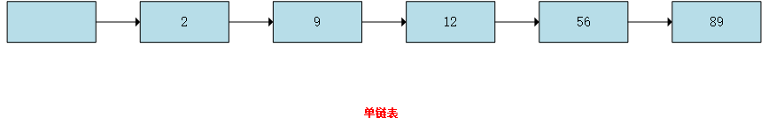
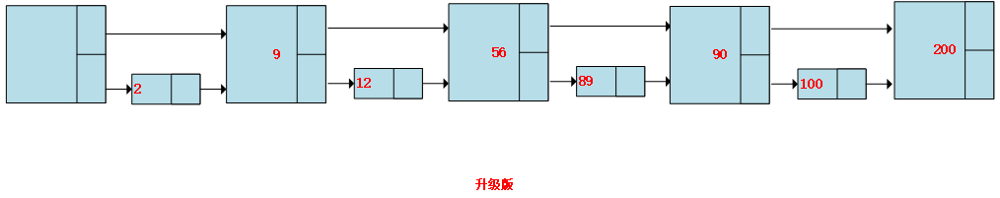
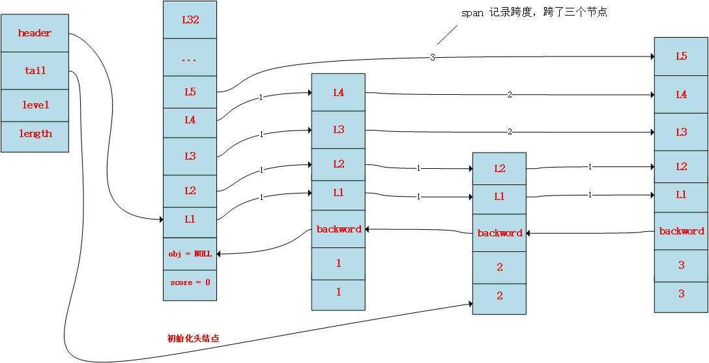

# 跳跃表

## 跳跃表简介

今天学习redis，看到跳跃表，就特意学习了一下，做个笔记。要说跳跃表，以及为什么要有跳跃表，我们先从链表开始说起。下图是一个`有序链表`：


在一个简单链表中，执行一次查找的时间是正比于必须遍历的节点个数，他的时间复杂度是O(N)，比如要查找89这个节点，我们必须要遍历整个链表，一共5次。

显然当数据量大的时候，这种数据结构查询效率太低，所以接下来，引入另一种改进版的链表。如图所示


在该改进版的链表中，每隔一个节点就有一个附加的指针指向它在表中的前两个位置。因此，要查找一个节点，最多只需要遍历N/2+1个节点。例如找200，只需要在第二层遍历4次，要找100，只需要查找5次，先在第二层查找4次，没有找到，因为链表有序，所以退回到第一层到节点90，在往前找到100。

接下来，我们对上一个链表在进行扩展完善，得到一个完美的跳跃表。参考下一节


## Redis中的跳跃表

redis中跳跃表的代码层级的结构定义

```c
// 跳跃表中的节点
typedef struct zskiplistNode {

    // 成员对象，真正的数据
    robj *obj;

    // 分值，用来排序
    double score;

    // 后退指针，指向上一个节点
    struct zskiplistNode *backward;

    // 层
    struct zskiplistLevel {

        // 前进指针， 记录下一个指向的节点
        struct zskiplistNode *forward;

        // 跨度， 记录距离
        unsigned int span;

    } level[];

} zskiplistNode;
```


```c
// 跳跃表的结构
typedef struct zskiplist {

    // 表头节点和表尾节点
    struct zskiplistNode *header, *tail;

    // 节点的数量
    unsigned long length;

    // 最大层数
    int level;

} zskiplist;
```

基于以上代码我们画出一个示例图，在结合上一节总结一下跳跃表一些属性。

- `header`，`tail`两个指针，为别指向跳跃表的头和尾，每个节点，
- `level`保存最大层数，下面这个图就有5层，表头不算
- `length`保存节点数量，下面这个图就有3个节点，表头不算

在看跳跃表中每个节点的属性

- `*obj`这个指针表示`用户数据`在计算机中存储的地址，
- double类型的分值`score`，用来排序，我们的跳跃表是有序的。
- `*backword`指针用来指向上一个节点，用在比如当我们要找2，那第一次在第5层找，没有找到，就得根据`*backword`定位到前一个节点。
- `zskiplistLevel`保存层级信息，包括`span`记录跨度、`*forward`记录下一个指针。




## 创建跳跃表

```c
/*
 * 创建跳跃表
 *
 */
zskiplist *zslCreate(void) {
    int j;
    zskiplist *zsl;

    // 分配空间
    zsl = zmalloc(sizeof(*zsl));

    // 设置高度和起始层数
    zsl->level = 1;
    zsl->length = 0;

    // 初始化哨兵节点
    zsl->header = zslCreateNode(ZSKIPLIST_MAXLEVEL,0,NULL);
    for (j = 0; j < ZSKIPLIST_MAXLEVEL; j++) {
        zsl->header->level[j].forward = NULL;
        zsl->header->level[j].span = 0;
    }
    zsl->header->backward = NULL;

    // 设置表尾
    zsl->tail = NULL;

    return zsl;
}

/*
 * 创建一个层数为 level ,分值为score, 指向obg的的跳跃表节点
 */
zskiplistNode *zslCreateNode(int level, double score, robj *obj) {
    
    // 分配空间
    zskiplistNode *zn = zmalloc(sizeof(*zn)+level*sizeof(struct zskiplistLevel));

    // 设置score和obj
    zn->score = score;
    zn->obj = obj;

    return zn;
}
```

剩下的API等有空在研究


