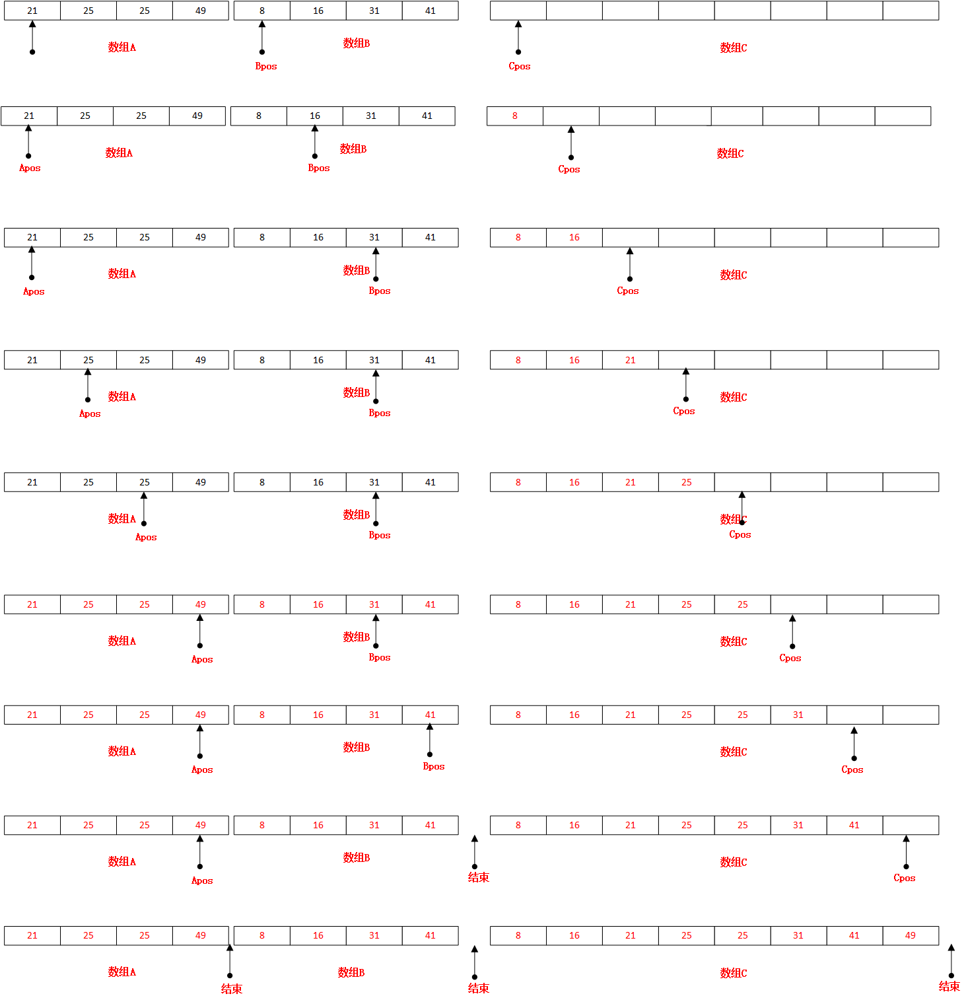
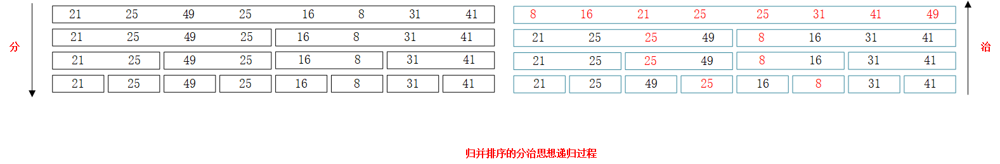

# 归并排序

所谓归并排序，意思就是合并两个已经有序的列表，然后输出到结果列表。这一点从字面意思也能大概看来。下面我们从两个点说归并排序：

1. 归并排序的归并怎么归？
2. 归并排序需要两个已经排序的数组，这两个数组从何处来？

## 归并排序的归并怎么归

假设有两个已经排序的数组A和B以及一个空数组C，那么归并排序的归并过程大致如下所示：

假设有两个指针Apos和Bpos分别指向数组A和数组B的第一个位置，C指向数组C的第一个位置。

第一步，比较Apos和Bpos位置的值，将最小的放到C，并且Cpos自增1指向下一个空位。在我们的例子中，21比8大，所以将8放到C的第一位，Cpos自增1，指向第二个元素，并且Bpos也得自增1，指向数组B的下一个元素。最后直到将数组A 或数组B中剩余的元素直接拷贝到数组C，归并完成。



## 归并排序需要两个已经排序的数组，这两个数组从何处来



归并排序基于分而治之的思想，利用了递归的实现方式。这两个数组自然是从给定原始数组中`分`来，如上图所示，给定一个8个元素的数组，首先将他分为两个数组，每个数组包含4个元素，在将这两个数组分成4个数组，每个数组包含2个元素，最后将这4个数组分成8个数组，每个数组包含一个元素，这个时候每个数组剩下一个元素，自然而然已经是排序的了`(这就是我们的递归终止条件)`。到了这一步以后，在进行治的过程，这个过程结合上面两张图可以很清楚的看明白了。好了到这里该抄一抄书上的代码了。

## 代码

```java
    /**
     * 归并两个数组到一个数组，分而治之的治
     *
     * @param arr 原始数组
     * @param tmpArr 存放合并结果的数组
     * @param leftPos 子数组最左边的索引
     * @param rightPos 第二部分数组的开始位置
     * @param rightEnd
     */
    private static void merge(int[] arr, int[] tmpArr, int leftPos, int rightPos, int rightEnd) {
        int leftEnd = rightPos - 1;
        int tmpPos = leftPos;
        int numElements = rightEnd - leftPos + 1;
        while (leftPos <= leftEnd && rightPos <= rightEnd) {
            if (arr[leftPos] <= arr[rightPos]) {
                tmpArr[tmpPos++] = arr[leftPos++];
            } else {
                tmpArr[tmpPos++] = arr[rightPos++];
            }
        }
        // 拷贝左边数组的剩余元素到临时数组
        while (leftPos <= leftEnd) {
            tmpArr[tmpPos++] = arr[leftPos++];
        }
        // 拷贝右边数组的剩余元素到临时数组
        while (rightPos <= rightEnd) {
            tmpArr[tmpPos++] = arr[rightPos++];
        }
        // 拷贝临时数组的元素到给定数组，实现排序
        for (int i = 0; i < numElements; i++, rightEnd--) {
            arr[rightEnd] = tmpArr[rightEnd];
        }
    }

    /**
     * 归并排序，分而治之的分
     *
     * @param arr 原始数组
     * @param tmpArr 存放合并结果的临时数组
     * @param left 最左边索引
     * @param right 最右边索引
     */
    private static void mergeSort(int[] arr, int[] tmpArr, int left, int right) {
        if (left < right) {
            int center = (left + right) / 2;
            mergeSort(arr, tmpArr, left, center);
            mergeSort(arr, tmpArr, center + 1, right);
            merge(arr, tmpArr, left, center + 1, right);
        }
    }

    public static void mergeSort(int[] arr) {
        int[] tmpArr = new int[arr.length];
        mergeSort(arr, tmpArr, 0, arr.length - 1);
    }
```

## 时间复杂度

归并排序的时间复杂度最好、最差、平均都是O(nlog<sub>2</sub>n)。且是一种稳定的排序方式

