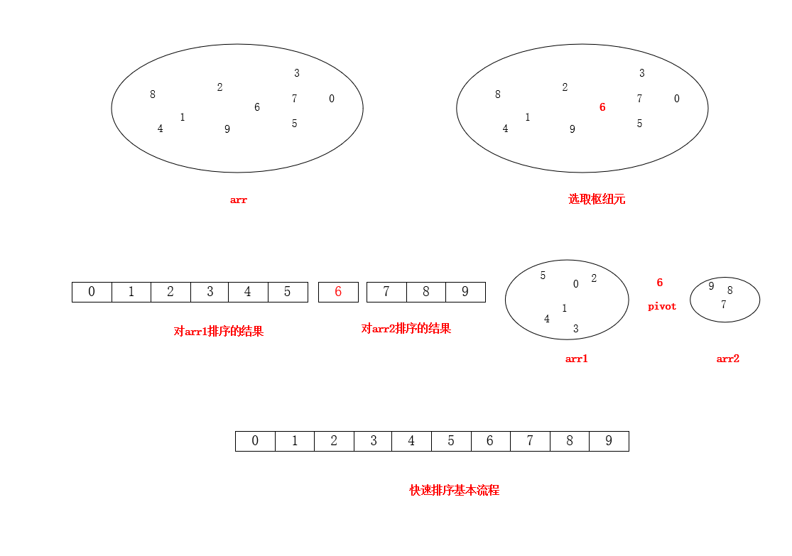
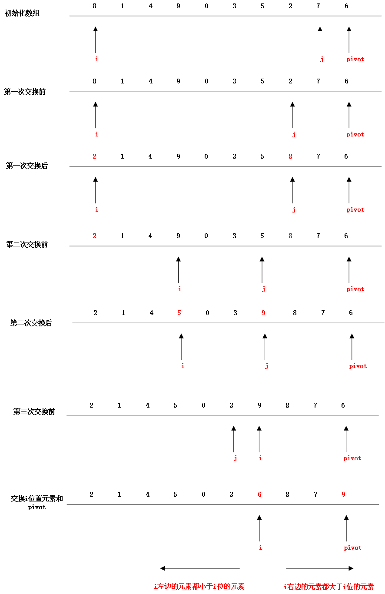

# 快速排序

## 快速排序的基本流程

`快速排序`顾名思义是通过实践发现，性能快于其他排序算法的一种算法。他的基本排序思想分为下面几步，假设给定一个待排序的数组arr

1. 如果arr中元素的个数是0或者1，则结束程序，因为快速排序是用递归实现的，所以这一步可以看做递归的出口
2. 选取数组arr中任一个元素，成为`枢纽元(pivot)`
3. 通过pivot将数组分成两个不想交的子数组arr1和arr2，其中arr1中的元素均小于pivot，arr2中的元素均大于pivot
4. 在对上面的arr1和arr2递归的实现这个过程，直到排序完成



## 选取枢纽元pivot的几种方案

### 选取第一个元素

在排序序列是随机输入的情况下，选取第一个元素并没有什么影响，但是如果出现待排序序列是基本有序的或者逆序的，那么就会出现所有的元素不是被划分到arr1就是arr2中，且在以后的每一个递归过程中，都无法避免这种情况出现，导致快速排序的性能退化成N<sup>2</sup>级。但是其实代码却并没有做什么实际的工作。所以这种方法是`不可取`的。

### 随机选取

采用随机选取的方法可以有效避免上面的情况，但是随机数的生成也是一个开销较大的工作，不利于提高快速排序的效率。

### 三数中值法

假设如果每次我们选取的枢纽元都是这个数组的中值，那么一半元素分到arr1，一半元素分到arr2，再好不过，但是要每次计算出来这个中值，又得花费一些时间，拖慢排序的效率。因此我们的前辈们为我们提出了这样一种方案，就是选取待排序数组的左端元素，右端元素和中间元素，取他们中间的中值。那么就上面那个数组**[8, 1, 4, 9, 6, 3, 5, 2, 7, 0]**，arr[left] = 8, arr[right] = 0, arr[(left + right) / 2] = 6，所以pivot = 6。实践证明这是最好的安排。

## 分割策略

关于快速排序的第三步`分割策略`也有好多种，今天我们介绍教科书上介绍的被认为是比较优秀的一种分割策略。基本分为以下几个步骤：

1. 交换枢纽元与最后的元素，是枢纽元离开要被分割的数据段
2. i从第一个元素开始，j从第二个元素开始，向中间移动。当i找到一个比pivot大的元素停下，当j找到一个比pivot小的元素停下，交换位置，直到i和j错开
3. 第二步以后，在交换i位置的元素和最后一个元素，分割结束，这个时候位置i的左侧都是小于pivot的元素，右侧都是大于pivot的元素
4. 这个过程是可以优化的，在上一节三数中值法取到arr[left]、arr[right]、pivot后，其实可以将最大值放到最右侧，最小值放到最左侧，pivot放到right-1的位置，然后i从left+1开始，j从right-2开始，

`

## 进一步优化

对于数据量小的序列，因为快速排序表现是不如插入排序表现出色的，所以我们这里取一个界定值CUTOFF，当待排序序列元素个数小于10的时候，使用插入排序，大于10的那时候使用快速排序。

结合以上讨论，我们给出代码实现：

```java
    // 当序列元素个数少于这个界限则使用快速排序
    // 小规模数据用插入排序效率更高
    private static final int CUTOFF = 10;

    /**
     * 快速排序
     *
     * @param arr 待排序的数组
     * @param left 数组最左边的元素索引
     * @param right 数组最右边的元素索引
     */
    public static void quickSort(int[] arr, int left, int right) {
        if (left + CUTOFF < right) {
            int pivot = media3(arr, left, right);
            int i = left, j = right - 1;
            for ( ; ;) {
                while (arr[++i] < pivot) {}
                while (arr[--j] > pivot) {}
                if (i < j) {
                    swapReferences(arr, i, j);
                } else {
                    break;
                }
            }
            swapReferences(arr, i , right - 1);
            quickSort(arr, left, i - 1);
            quickSort(arr, i + 1, right);
        } else {
            insertSort(arr, left, right);
        }

    }
	
	// 插入排序
    private static void insertSort(int[] arr, int left, int right) {
        int j = 0;
        for (int i = left + 1; i <= right; i++) {
            int tmp = arr[i];
            for (j = i; j > 0 && tmp < arr[j - 1]; j--) {
                arr[j] = arr[j - 1];
            }
            arr[j] = tmp;
        }
    }

    /**
     * 三数中值法选定枢纽元,取left，right, (left + right) / 2三数的中间值，并将三数中最小的放到arr[left]
     * 最大的放到arr[right]，枢纽元放到arr[right - 1]
     *
     * @param arr 待排序数组
     * @param left 数组的第一位元素索引
     * @param right 数组的最后一位元素索引
     * @return 枢纽元 pivot
     */
    private static int media3(int[] arr, int left, int right) {
        int center = (left + right) / 2;
        if (arr[center] < arr[left]) {
            swapReferences(arr, left, center);
        }
        if (arr[right] < arr[left]) {
            swapReferences(arr, left, right);
        }
        if (arr[right] < arr[center]) {
            swapReferences(arr, center, right);
        }
        swapReferences(arr, center, right - 1);
        return arr[right - 1];
    }

    private static void swapReferences(int[] arr, int left, int right) {
        int tmp = arr[left];
        arr[left] = arr[right];
        arr[right] = tmp;
    }
```

## 快速排序的时间复杂度

时间复杂度这个问题说起来比较复杂，这里只给出书本上的结论吧，有时间在研究研究推导公式

最坏情况（每次选取的pivot都是最小值）：O(N<sup>2</sup>)

平均情况：O(NlogN)