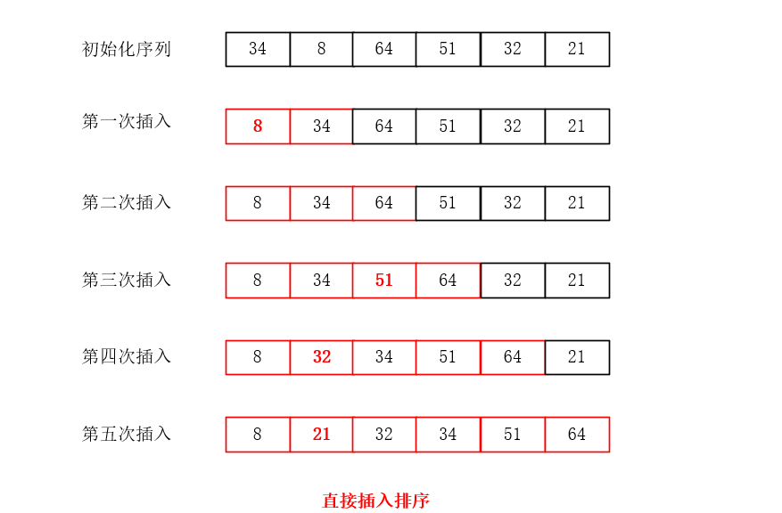
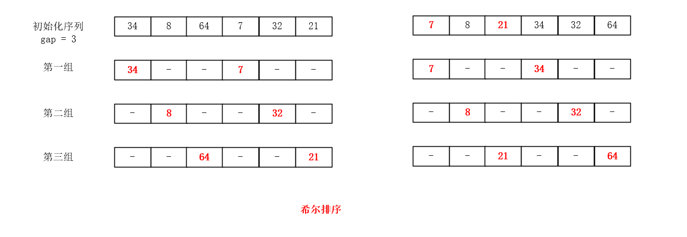

# 插入排序

插入排序的基本原则是，将一个待排序的元素，按照排序规则，插入到前面已经排好序的一组元素的适当位置，直到元素全部插入为止。根据寻找插入位置的不同方式，可将插入排序分为`直接插入排序`和`折半插入排序`，还有一种对直接插入排序的优化方案`希尔排序`。

## 直接插入排序

直接插入排序的是，将一组待排序的元素第一个元素看做是有序的，然后从第二个元素开始，将他插入到前面排好序的一组元素的合适的位置。结合下面 的一组数据说吧

第一步：从元素8开始，往前查找，发现8比34小，则将8插入到34前面

第二步：从元素64开始，往前查找，发现没有比64小的元素，则64不动

第三步：从元素51开始，往前查找，发现没有比64小的元素，则64不动

。。。依次类推



代码实现

```java
/**
 * 插入排序
 *
 * @Author HXY
 * @Date 2020/2/25
 */
public class InsertionSort {
    public static void sort(int[] arr) {
        int j = 0;
        for (int i = 1; i < arr.length; i++) {
            int tmp = arr[i];
            for (j = i; j > 0 && arr[j] < arr[j - 1]; j--) {
                arr[j] = arr[j - 1];
            }
            arr[j] = tmp;
        }
    }

    public static void main(String[] args) {
        int[] arr = new int[] {34, 8, 64, 51, 32, 21};
        sort(arr);
        for (int i = 0; i < arr.length; i++) {
            System.out.print(arr[i] + " ");
        }
    }
}
```

直接插入排序算法在最好的情况下，也就是这组数据已经排好序的情况下，内层for循环的条件每次判定失败，只执行外层的fort循环，时间复杂度可以看做O(N)。而在最坏情况下，也就是一组要从小到大排序的数据，初始化恰恰是从大到小排序的，这个时候时间复杂度是O(N<sup>2</sup>)，一般情形下也是O(N<sup>2</sup>)。

## 折半插入排序

折半插入排序就是在直接插入排序的`寻找插入点`这个步骤进行了优化，将原来的遍历优化成折半查找。代码如下：

```java
public static void sort(int[] arr) {
    int j = 0;
    for (int i = 1; i < arr.length; i++) {
        int low = 0, high = i - 1, mid = 0;
        int tmp = arr[i];
        // 寻找插入点
        while (low <= high) {
            mid = (low + high) / 2;
            if (arr[i] < arr[mid]) {
                high = mid - 1;
            } else {
                low = mid + 1;
            }
        }
        // 将插入点后的元素统一后移，然后将元素插入插入点
        for (j = i; j > high + 1; j--) {
            arr[j] = arr[j - 1];
        }
        arr[high + 1] = tmp;
    }
}
```

当数据较多时，折半插入排序平均性能优于直接插入排序，但是比直接插入排序的最好情况是要差的。因此当初始化序列接近有序时，用直接插入排序性能更好。这两个都是`稳定`的排序方式

## 希尔排序

结合上面的讨论我们得知，当数据量相对较小或者序列基本有序时，插入排序的效率是比较高的。因此希尔大佬在这两个点上对插入排序进行了优化，发明了希尔排序。希尔排序的主要思想就是

1. 将一个大的序列通过一个整数`gap(增量)`拆分成几组数据量小的子序列，先对这一个个子序列进行插入排序
2. 经过上面这一步后，这个大的序列基本有序了，这个时候在执行一遍插入排序

具体的过程参见下图



我们采取gap=3这个增量将初始化序列在逻辑上分为三个子序列，然后对这三个子序列进行插入排序，这一步后这个序列基本有序，我们在控制gap=1，这时候就相当于对这个大的序列进行一次插入排序。

代码如下：

```java
// 希尔排序
public static void shellSort(int[] arr) {
    int j = 0;
    // 1. 分组
    for (int gap = arr.length / 2; gap > 0; gap /= 2) {
        // 2. 相当于遍历分出来的几个组
        for (int i = gap; i < arr.length; i++) {
            int tmp = arr[i];
            // 对组内的元素排序
            for (j = i; j >= gap && tmp < arr[j - gap]; j -= gap) {
                arr[j] = arr[j - gap];
            }
            arr[j] = tmp;
        }
    }
}
```

希尔排序的时间复杂度与这个增量的取用关系较大，至今无人能对一般情形下的时间复杂度给出证明，我这种菜鸟就暂不研究了。另外这是一种`不稳定`的排序方式。