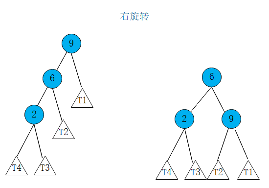

# AVL树
## 定义
+ AVL树本质上还是一颗二叉搜索树，其特性是对于任意一个节点，左子树和右子树的高度差不能超过1，所以AVL树也称为平衡二叉树
+ 平衡二叉树的高度和节点数量之间的关系也是O(logN)
+ 平衡因子： `左右子树的高度差`
## 为什么需要AVL树
当我们顺序将一组从小到大的数据（1,2,3,4,5）插入到一颗空的二叉搜索树，那么你可以发现这个时候二叉搜索树已经完全退化成为了一个链表，他的各操作的时间复杂度也将从O(logN)变成为线性的O(N)。

## AVL树的自平衡机制
### 什么时候会破坏平衡
当插入一个节点后，会更新新节点对应的父亲节点以及祖先节点的平衡因子，导致向上的节点的左右子树高度差超过1。所以当插入一个节点后，我们应该沿着新节点向上维护AVL树的平衡性。

### 需要维护平衡的四种情况
#### 右旋转

以下情况中，当插入节点2到树中时候，根据二叉搜索树的性质，会将节点2插入到节点6的左边，从而打破本来的平衡性，使得节点9的平衡因子大于1.这个时候我们可以通过`右旋转`这种操作来维护节点9的平衡性。首先将节点6的右子树T2和节点6分离，然后将节点9下沉，挂载到节点6的右子树上，最后将节点6原来的右子树T2挂载到节点9的左子树上，此时节点9达到平衡，并且依然保持二叉搜索树的基本性质。

代码实现如下：
```
    // 对节点y进行向右旋转操作，返回旋转后新的根节点x
    //        y                              x
    //       / \                           /   \
    //      x   T4     向右旋转 (y)        z     y
    //     / \       - - - - - - - ->    / \   / \
    //    z   T3                       T1  T2 T3 T4
    //   / \
    // T1   T2
    /**
     * 右旋转
     * @param node
     * @return
     */
    private Node rightRotate(Node y) {
        // 使X和T3脱离
        Node x = y.left;
        Node T3 = x.right;

        // 旋转过程
        x.right = y;
        y.left = T3;

        // 更新高度
        y.height = Math.max(y.left.height, y.right.height) + 1;
        x.height = Math.max(x.left.height, x.right.height) + 1;

        return x;
    }
```
#### 左旋转
以下情况中，当插入节点11到树中时候，根据二叉搜索树的性质，会将节点11插入到节点10的右边，从而打破本来的平衡性，使得节点9的平衡因子大于1。这个时候我们可以通过`左旋转`这种操作来维护节点9的平衡性。首先将节点10的左子树T2和节点10分离，然后将节点9下沉，挂载到节点10的左子树上，最后将节点10原来的左子树T2挂载到节点9的右子树上，此时节点9达到平衡，并且依然保持二叉搜索树的基本性质。

代码实现如下
```
    // 对节点y进行向左旋转操作，返回旋转后新的根节点x
    //    y                             x
    //  /  \                          /   \
    // T1   x      向左旋转 (y)       y     z
    //     / \   - - - - - - - ->   / \   / \
    //   T2  z                     T1 T2 T3 T4
    //      / \
    //     T3 T4
    /**
     * 左旋转
     * @param y
     * @return
     */
    private Node leftRotate(Node y) {
        // 使x和T2脱离
        Node x = y.right;
        Node T2 = x.left;

        // 左旋转过程
        x.left = y;
        y.right = T2;

        // 更新高度
        y.height = Math.max(y.left.height, y.right.height) + 1;
        x.height = Math.max(x.left.height, x.right.height) + 1;

        return x;
    }
```
#### RL
除过上面提到的情况，我们还有可能发生下面这种情况。当我们在树中插入节点10的时候，按照二叉搜索树的规则，10会被插入到节点11的左边，这时候也会打破原来的平衡，使得节点9的平衡因子大于1。这个时候我们的解决方案是先对节点10做一次右旋转，这个时候变成我们上面讨论过的第二种情况，然后再做一次左旋转，即可达到平衡。


#### LR
当然我们新插入的节点也可能这样分布，如下图所示。当我们在树中插入节点10的时候，发生下面这种情况，和上面的RL正好是对称的，因此我们只需要根据上面做对称的操作，即先对节点10进行一次左旋转，变成上面讨论的第一种情况，在进行一次右旋转，以11为根的树就达到平衡。


## AVL树的基本API
### 插入
有了以上的讨论基础，下面我们给出AVL树的插入操作代码。即在二叉搜索树的插入逻辑上再加上上述四种情况下平衡的维护逻辑即可。
```
    /**
     * 向以node为根的树中添加元素
     * @param node
     * @param key
     * @param value
     * @return 插入元素后新的树结构
     */
    private Node add(Node node, K key, V value) {
        if (null == node) {
            size ++;
            return new Node(key, value);
        }

        if (key.compareTo(node.key) < 0) {
            node.left = add(node.left, key, value);
        } else if (key.compareTo(node.key) > 0) {
            node.right = add(node.right, key, value);
        } else {
            node.value = value;
        }

        // 维护每一个节点的height
        node.height = 1 + Math.max(getHeight(node.left), getHeight(node.right));

        // 计算平衡因子
        int balanceFactor = getBalanceFactor(node);

        // 平衡维护
        // LL
        if (balanceFactor > 1 && getBalanceFactor(node.left) >= 0) {
            return rightRotate(node);
        }

        // RR
        if (balanceFactor < -1 && getBalanceFactor(node.right) <= 0) {
            return leftRotate(node);
        }

        // LR
        if (balanceFactor > 1 && getBalanceFactor(node.left) < 0) {
            node.left = leftRotate(node.left);
            return rightRotate(node);
        }

        // RL
        if (balanceFactor < -1 && getBalanceFactor(node.right) > 0) {
            node.right = rightRotate(node.right);
            return leftRotate(node);
        }
        return node;
    }
```
### 更新和查询
同二叉搜索树的。不多讨论
```
    /**
     * 返回以node为跟的书中key所在的节点
     * @param key
     * @return
     */
    private Node getNode(Node node, K key) {
        if (null == node) {
            return null;
        }

        if (key.equals(node.key)) {
            return node;
        } else if (key.compareTo(node.key) < 0) {
            return getNode(node.left, key);
        } else {
            return getNode(node.right, key);
        }
    }

    public V get(K key) {
        Node node = getNode(root, key);
        return null == node ? null : node.value;
    }

    public void set(K key, V value) {
        Node node = getNode(root, key);
        if (null == node) {
            throw new IllegalArgumentException(key + "does not exists");
        }

        node.value = value;
    }
```
### 删除
删除操作也和二叉搜索树基本一样，只是加上平衡的维护逻辑。关于二叉搜索树的删除操作，这里不再赘述，参考二叉搜索树的笔记。[二叉搜索树](https://blog.csdn.net/weixin_40149557/article/details/95931060)
```
    private Node remove(Node node, K key){

        if(null == node) {
            return null;
        }

        Node retNode;
        if( key.compareTo(node.key) < 0 ) {
            node.left = remove(node.left , key);
            retNode = node;
        } else if(key.compareTo(node.key) > 0 ) {
            node.right = remove(node.right, key);
            retNode = node;
        } else {   // key.compareTo(node.key) == 0

            // 待删除节点左子树为空的情况
            if(null == node.left) {
                Node rightNode = node.right;
                node.right = null;
                size --;
                retNode = rightNode;
            // 待删除节点右子树为空的情况
            } else if(null ==  node.right) {
                Node leftNode = node.left;
                node.left = null;
                size --;
                retNode = leftNode;
            // 待删除节点左右子树为空的情况
            } else {
                // 找到比待删除节点大的最小节点, 即待删除节点右子树的最小节点
                // 用这个节点顶替待删除节点的位置
                Node successor = minimum(node.right);
                successor.right = remove(node.right, successor.key);
                successor.left = node.left;
                node.left = node.right = null;
                retNode = successor;
            }
        }

        if(null != retNode) {

            // 更新height
            retNode.height = 1 + Math.max(getHeight(retNode.left), getHeight(retNode.right));

            // 计算平衡因子
            int balanceFactor = getBalanceFactor(retNode);

            // 平衡维护
            // LL
            if (balanceFactor > 1 && getBalanceFactor(retNode.left) >= 0) {
                return rightRotate(retNode);
            }

            // RR
            if (balanceFactor < -1 && getBalanceFactor(retNode.right) <= 0) {
                return leftRotate(retNode);
            }

            // LR
            if (balanceFactor > 1 && getBalanceFactor(retNode.left) < 0) {
                retNode.left = leftRotate(retNode.left);
                return rightRotate(retNode);
            }

            // RL
            if (balanceFactor < -1 && getBalanceFactor(retNode.right) > 0) {
                retNode.right = rightRotate(retNode.right);
                return leftRotate(retNode);
            }
        }
        return retNode;
    }
```
注：主要参考慕课网的课程`玩转算法系列--数据结构精讲`。作为学习笔记总结。
