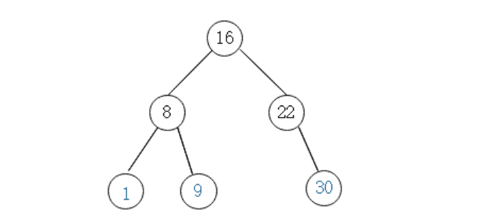
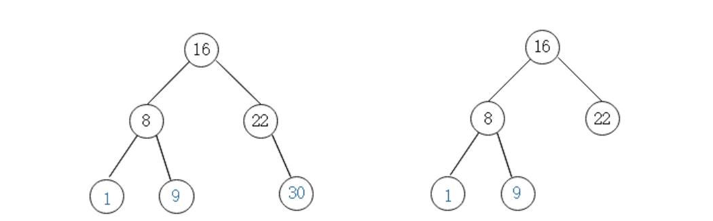
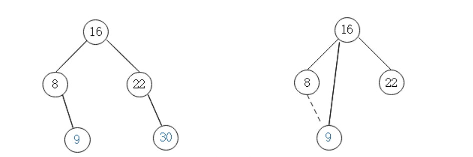
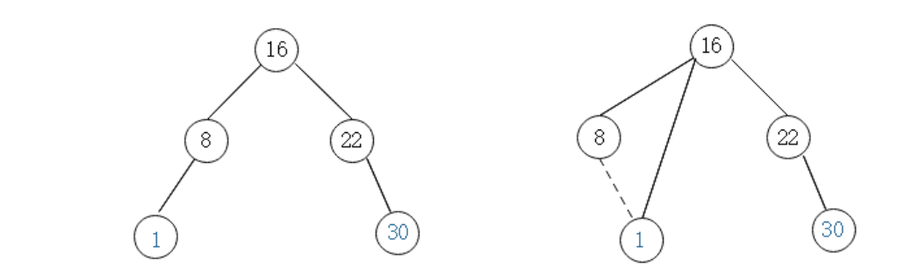
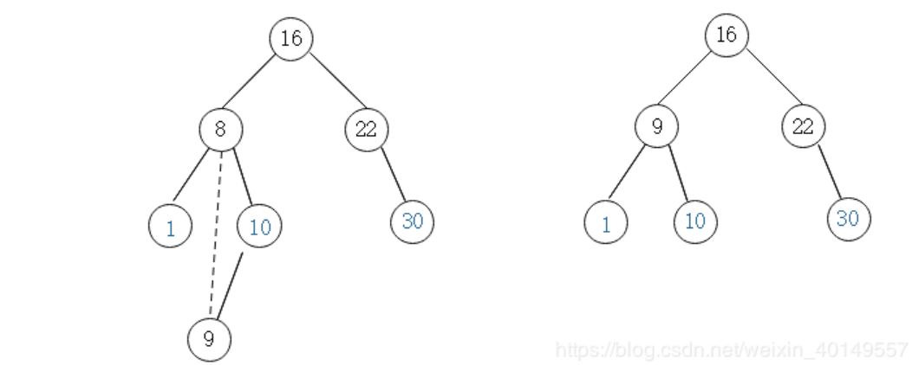

# 二叉搜索树
## 定义
树的概念这里不做说明，在假设我们都知道二叉树的情况下，那么二叉查找树就是符合以下情况的一种特殊的二叉树：对于二叉查找树的某个节点X，他的左子树中所有的节点值都小于X节点的值，右子树所有节点的值都大于X节点的值。例如下面这颗树，就是一个二叉搜索树。该树结构中，16左边的节点都小于16，16右边的节点大于16，其他节点同理。那下面我们分别讨论二叉查找树的增删改查几个重要方法。


## 二叉查找树的API
### 查找
因为二叉搜索树的特点，所以我们查找一个节点是不是在二叉搜索树中，一般有两步，以上面的二叉搜索树为例，查找元素9：
1. 访问根节点，如果根节点的值正好和查询的元素相等，那么直接返回，这里9不等于16，接续第二步。
2. 判断9是否大于16，是则从16的右边开始查，否则，从16的左边查，这里9小于16，从16的左边查，定位到8，发现9大于8，从8的右边查，找到9。很显然，二叉搜索树的查询时间复杂度，是优于链表的。下面给出代码实现。
```java
/**
 * 以node为根的二叉搜索树是否包含元素e
 * @param node
 * @param e
 * @return
 */
private boolean contains(Node node, E e) {
    // 递归终止条件
    if (null == node) {
        return false;
    }

    if (e.compareTo(node.e) == 0) {
        return true;
    } else if (e.compareTo(node.e) < 0) {
        return contains(node.left, e);
    } else  {
        return contains(node.right, e);
    }
}
```

### 插入
了解了查询的过程，插入就是可以用contains的方法遍历树，如果找到对应的节点，在做一次更新，否则，就插入到遍历的路径上的最后一个空节点。下面给出代码。

```java
/**
 * 递归添加元素
 * @param node
 * @param e
 * @return 返回插入新节后二叉搜索树的根
 */
private Node add(Node node, E e) {
    if (null == node) {
        size ++;
        return new Node(e);
    }

    if (e.compareTo(node.e) < 0) {
        // 添加返回值将new出来的节点挂载到树上
        node.left = add(node.left, e);
    } else if (e.compareTo(node.e) > 0) {
        node.right = add(node.right, e);
    }

    return node;
}
```

### 删除
删除相对于增加和查找元素，比较复杂，因为要考虑到这样几种情况。
+ case1 以下图为例，删除元素30，那么我们直接删除30就可以


+ case2：删除元素8，这个时候8没有左孩子，所以删除元素8以后，我们可以直接让8的右孩子替代8，成为16的左孩子。


+ case3：还是删除元素8，这个时候8没有右孩子，那么我们可以让8的左孩子替换8成为16的左孩子。


+ case4：还是删除元素8，这次8既有左孩子，也有右孩子。这种情况我们一般的策略是找到元素8右孩子中的最小的元素，也就是9，让他替代8的位置


```java
/**
 * 删除指定元素
 * @param node 节点
 * @param e 待删除的元素
 * @return 删除后的根节点
 */
private Node remove(Node node, E e) {
    if (null == node) {
        return null;
    }

    if (e.compareTo(node.e) < 0) {
        node.left = remove(node.left, e);
        return node;
    } else if (e.compareTo(node.e) > 0) {
        node.right = remove(node.right, e);
        return node;
    } else {

        // 左子树为空
        if (null == node.left) {
            Node rightNode = node.right;
            node.right = null;
            size --;
            return rightNode;
        }

        // 右子树为空
        if (null == node.right) {
            Node leftNode = node.left;
            node.left = null;
            size --;
            return leftNode;
        }

        // 待删除节点左右子树都不为空
        // 找到待删除元素的右子树的最小节点，替换待删除元素
        Node successor = minNum(node.right);
        // successor现在替换了node的位置，就要将successor从原来的位置删除
        successor.right = removeMin(node.right);
        successor.left = node.left;
        node.left = null;
        node.right = null;
        return successor;
    }
}
```
### 其他API
关于二叉搜索树的其他操作，例如深度优先遍历、广度优先遍历、查询最大最小元素等代码，基本都是用了递归的方法，具体参考同目录下BSTree.java。

文章代码参考《数据结构与算法分析》和慕课网liuyubobobo老师的算法大师带你玩转数据结构的课程。这里作为学习笔记整理。推荐一篇写的很不错的博客：[浅谈算法和数据结构: 七 二叉查找树](https://www.cnblogs.com/yangecnu/p/Introduce-Binary-Search-Tree.html)