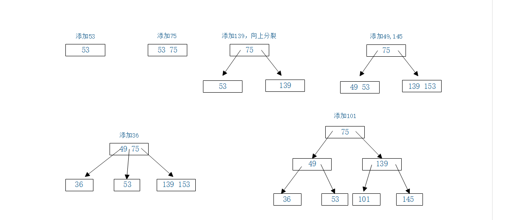

# B-树

## 为什么要有B树
我们知道AVL树是是一个高度平衡的树，他的查询和插入时间复杂度已经可以达到O(logN)，那么我们为什么还要有B树这种结构呢。这是因为计算机读取数据当然是把数据加载到内存中读取的，当数据小的时候，我们可以直接把他加到内存，这样当然效率很高。但是在有些情况下，比如数据库的索引，可能是一个很大的数据，这个时候我们想把它全部放到内存显然是不可能的，我们往往会把他放到磁盘中，然后从磁盘中加载。可是我们知道磁盘的I/O操作是比较慢的，而这时候如果我们还用AVL树这种又高又瘦的树，就会增加与磁盘的I/O次数。所以我们得想办法把他变得又矮又胖，从而减少磁盘I/O。这个时候我们今天的主角B树就派上用场了。今天我们先说B-树。

## B-树的定义
B树作为一种平衡的多路搜索树，他当然具有多路搜索树的所有性质加上自己的性质（空树可不满足以下性质）

1. 根节点至少有两个子树。
2. 根节点和叶子节点除外，其他节点至少有m/2向上取整个孩子。这开始两个性质保证了B-树的平衡性。
3. 例如上图所示B-树。节点a左边的节点存取的关键字都小于节点a的关键字，右边的节点存取的关键字都大于a的关键字
4. 例如节点g所示，该节点一共有两个关键字，左边的关键字小于右边的关键字，呈现树递增关系。
5. B-树的每一颗子树也得是一颗B-树。这是树的递归性。
6. 所有叶子节点都位于同一层。

## B-树的查找
如上B-树，我们要查找关键字50，则从根节点开始搜索。首先从磁盘中读取节点a，发现50比30大，便从右开始从磁盘中读取节点C。发现50比40还大，再次从磁盘中读取节点g，然后在节点g中找到关键字50.

## B-树的插入
注：当插入后节点的关键字个数超过了m阶B-树的节点关键字上限（m-1），那么则要进行分裂。将中间的数向上合并到父节点。直到重新满足B-树的定义。
